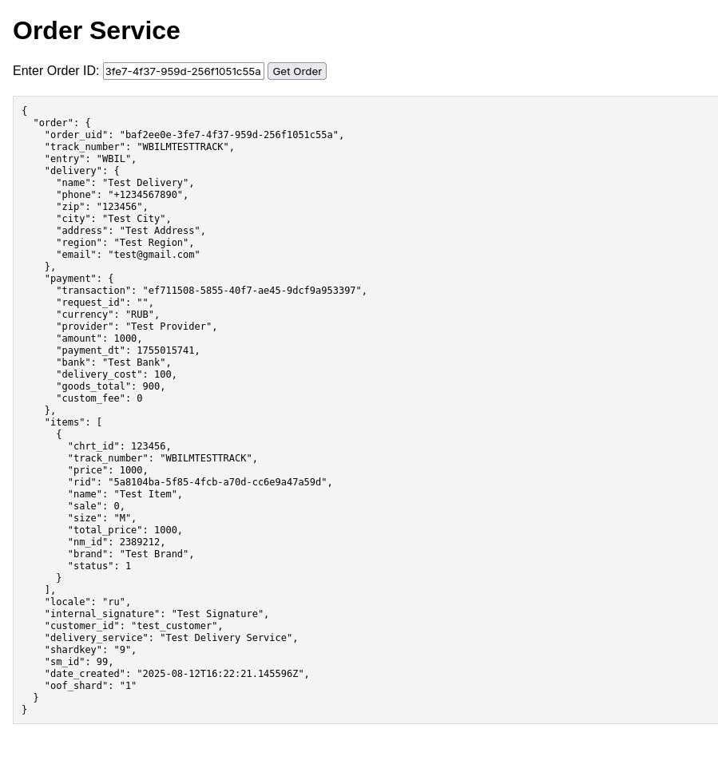

# Order Service

## Описание

**Order Service** — это демонстрационный микросервис, разработанный на Go, который обрабатывает данные о заказах. Сервис получает данные из очереди сообщений (Kafka), сохраняет их в базу данных (PostgreSQL), кэширует в памяти для быстрого доступа и предоставляет HTTP API для получения информации о заказах.

---
## Демонстрация работы

**Ссылка на видео в google drive**:  https://drive.google.com/file/d/1LxIvPLzt0TrPpZk0f5tLcK4a22nLwBRR/view?usp=sharing

---

## Функциональность

1. **Получение данных из Kafka**:
   - Сервис подписывается на канал сообщений Kafka и обрабатывает входящие данные о заказах.
   - Невалидные сообщения логируются и игнорируются.
   - Worker (Kafka consumer) был реализован с помощью библиотеки Sarama. Конфиг для консьюмера вынес в pkg/kafka/comsumer, реализация consumer в internal/app/consumer. Запускается в отдельной горутине при инициализации приложения в app.go 
   - Примитивный producer лежит в cmd/producer (Пишет в топик 10 заказов с рандомным UUID)

2. **Сохранение данных в PostgreSQL**:
   - Данные о заказах сохраняются в базе данных с использованием транзакций для обеспечения целостности данных. Менеджер транзакций и storage ( используется pgxpool ) лежат в pkg/pgstorage
   - Для миграций используется goose.
   - Данные для PostgreSQL лежат в .env (Для удобства .env.template показывает структуру .env)
   - При создании заказа использовал уровень изоляции Serializable. Можно было бы ограничиться repeatable read

3. **RETRY WITH BACKOFF для Kafka и Postgre**:
    - Используется Retry with Backoff , экспоненциальная реализация лежит в pkg/utils. Retry count и backoff задаются в config.yml отдельно для Kafka и отдельно для Postgre. 

4. **Кэширование данных**:
   - Последние полученные заказы кэшируются в Redis для ускорения доступа.
   - При перезапуске сервиса кэш восстанавливается из базы данных ( Последние 1000 заказов).
   - Клиента так же вынес в pkg/cache/redis, в pkg/cache лежит общий интерфейс для кэша.
   - Кэш живет 5 минут, TTL настраивается в config.yml
   - Так как приложение зависит от интерфейса, при большом желании можно поменять реализацию на map + mutex (sync.map)

5. **Unit && интеграционные тесты**:
    - Юнит тестами покрыл сервисный слой, RetryWithBackoff механизм. Интеграционные тесты лежат в tests/integration. 
6. **HTTP API**:
   - Эндпоинт для получения данных о заказе по его ID:
     ```
     GET http://localhost:8080/order/<order_uid>
     ```
   - Если данные есть в кэше, они возвращаются мгновенно. Если данных нет, они подтягиваются из базы и далее добавляются в кэш.
   - Использовал `chi`, инициализация в internal/app/http. Там же SetupRoutes, где подключаются базовые middleware(Logger, Recoverer, RequestID, RealIP, Timeout)

7. **Сбор метрик с помощью prometheus**:
    - Настроил сбор базовых метрик: общее количество http запросов, длительность http запросов, количество http errors (HTTP метрики собираются с помощью middleware ). Базовые бизнес метрики - количество созданных заказов, количество обработанных заказов (из кафки), метрики доступны по эндпоинту:
    ```
    http://localhost:8080/metrics
    ```
    - Пока что просто идет сбор, без красивой визуализации.
8. **SWAGGER**:
    - API документирована с помощью swagger
    ```

    http://localhost:8080/swagger/index.html

    ```
9. **Logger**:
    - Использовал slog с кастомной цветной надстройкой
10. **Валидация входных данных**:
    - Есть базовая валидация входных данных, в DTO структурах выставил поля validate, и далее с помощью github.com/go-playground/validator в handler слое происходит валидация. 

11. **Веб-интерфейс**:
   - Простая HTML-страница, где можно ввести ID заказа и получить информацию о нём. Для простоты интегрировал как internal/web 
12. **Makefile**:
    - В Makefile написаны инструкции для запуска тестов (make go-test), для запуска линтера (make go-lint), а так же для миграций - создание новой миграции (make migrate-create), применение миграций (make migrate-up) и для отката миграции (make migrate-down)
13. **CI**:
    - Написан простенький CI который запускает линтер и тесты.

---

## Архитектура
    - Исходную модель данных разбил на orders, delivery, payments, items и везде навесил b-tree индексы на order_uid. Находится в migrations/....init.sql. Так же в отдельной миграции заводится пользователь. 

## Установка и запуск

### Предварительные требования
- Docker и Docker Compose
- Go 1.24

### Шаги установки

1. Клонируйте репозиторий:
   ```bash
   git clone git@github.com:zhavkk/order-service.git
   cd order-service
   ```

2. Запустите сервисы с помощью Docker Compose:
   ```bash
   docker-compose up --build
   ```

3. Примените миграции для базы данных (при запуске автоматически применяются в скрипте entrypoint.sh):
   ```bash
   make migrate-up
   ```

4. Сервис будет доступен по адресу: `http://localhost:8080`

---

## Примеры использования API

### Получение данных о заказе
Запрос:
```bash
curl -X GET http://localhost:8080/order/<order_uid>
```
Ответ:
```json
{
  "order": {
    "order_uid": "baf2ee0e-3fe7-4f37-959d-256f1051c55a",
    "track_number": "WBILMTESTTRACK",
    "entry": "WBIL",
    "delivery": {
      "name": "Test Delivery",
      "phone": "+1234567890",
      "zip": "123456",
      "city": "Test City",
      "address": "Test Address",
      "region": "Test Region",
      "email": "test@gmail.com"
    },
    "payment": {
      "transaction": "ef711508-5855-40f7-ae45-9dcf9a953397",
      "request_id": "",
      "currency": "RUB",
      "provider": "Test Provider",
      "amount": 1000,
      "payment_dt": 1755015741,
      "bank": "Test Bank",
      "delivery_cost": 100,
      "goods_total": 900,
      "custom_fee": 0
    },
    "items": [
      {
        "chrt_id": 123456,
        "track_number": "WBILMTESTTRACK",
        "price": 1000,
        "rid": "5a8104ba-5f85-4fcb-a70d-cc6e9a47a59d",
        "name": "Test Item",
        "sale": 0,
        "size": "M",
        "total_price": 1000,
        "nm_id": 2389212,
        "brand": "Test Brand",
        "status": 1
      }
    ],
    "locale": "ru",
    "internal_signature": "Test Signature",
    "customer_id": "test_customer",
    "delivery_service": "Test Delivery Service",
    "shardkey": "9",
    "sm_id": 99,
    "date_created": "2025-08-12T16:22:21.145596Z",
    "oof_shard": "1"
  }
}
```

---

## Тестирование

1. Запустите тесты:
   ```bash
   make test
   ```

2. Для интеграционных тестов убедитесь, что все сервисы запущены через Docker Compose.

---

## Безопасность

- Для данных postgre нужно использовать .env . Пример .env находится в .env.template

---

## Веб-интерфейс

Веб-интерфейс доступен по адресу: `http://localhost:8080/`.

### Скриншот

---

